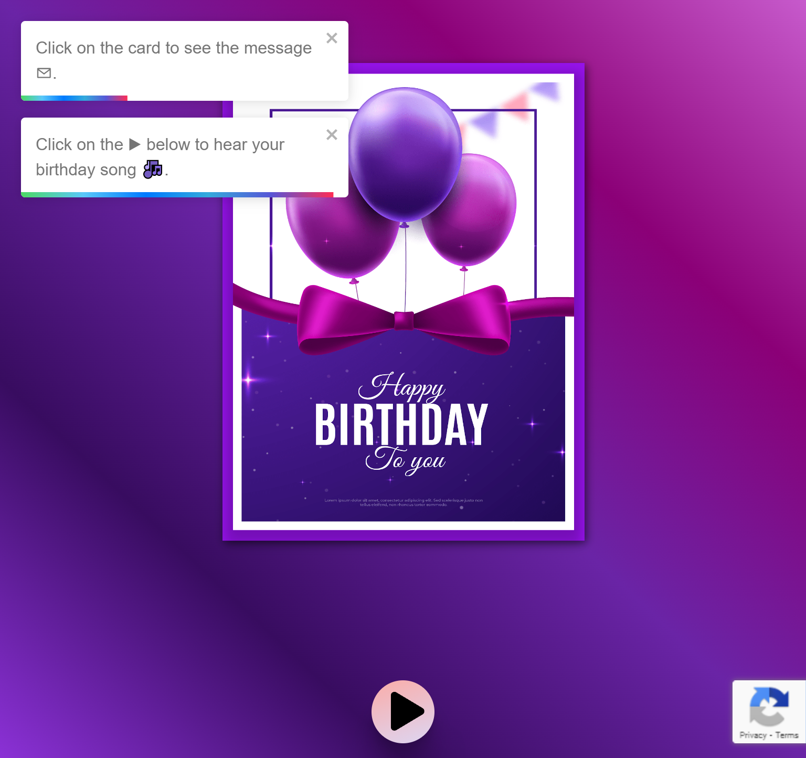

# Birthday Card <!-- omit in toc -->

> &ldquo;There was a star danced, and under that was I born.&rdquo;
>
> _Much Ado About Nothing_ - William Shakespeare.

## Table of Contents <!-- omit in toc -->

- [Demo 👁](#demo-)
- [License 🔑](#license-)
- [Quick Note 📝](#quick-note-)
- [Resources used 💿](#resources-used-)
  - [V-R-T Stack with Tailwind CSS](#v-r-t-stack-with-tailwind-css)
  - [Why did I use Firebase 🔥?](#why-did-i-use-firebase-)
    - [Hosting](#hosting)
    - [Storage](#storage)
    - [AppCheck](#appcheck)
  - [Uses of ReCaptcha V3 Badge](#uses-of-recaptcha-v3-badge)
  - [Alternatives of Firebase](#alternatives-of-firebase)
- [> 👆🏻 Most Cloud Storage services are Backend as a Service (BaaS). They are very likely to provide Cloud Functions, Database Storage etc.](#--most-cloud-storage-services-are-backend-as-a-service-baas-they-are-very-likely-to-provide-cloud-functions-database-storage-etc)
- [Discussion](#discussion)
  - [TODO Map 📍](#todo-map-)
- [Current Contributor(s)](#current-contributors)
- [Conclusion](#conclusion)

A birthday is a very special occassion for anyone regardless of their age. Just send them this card and your special wishes to your friend (or foe), just to make them feel special 🚀.

If it's your birthday, then you have my best wishes 🙏🏻. Enjoy the day 🎉, with a little dance 💃🏻 with that special one and understand with one extra notch up your belt your duties have been extended by one ✨.

It's your day from 0️⃣0️⃣:0️⃣0️⃣ to 2️⃣3️⃣:5️⃣9️⃣ and you should live to the fullest.

## Demo 👁

They say a demo is worth a thousand words. So if you head to the website [🔗https://birthday-card.web.app](https://birthday-card.web.app), you would be greeted 👯‍♂️👯‍♀️ with a birthday card 🎴.

## License 🔑

The project is open-source 📖 & used a MIT License 🗝. For more info on the scope of a MIT License, please check 🔗 [https://choosealicense.com/licenses/mit/](https://choosealicense.com/licenses/mit/).

To get a copy 🖨 of the license included, please see [LICENSE.md](LICENSE.md).

## Quick Note 📝

I have included a [💡 tips file](TIPS.md). It contains trips & tricks which make my life & project a bit easier.

## Resources used 💿

1. Vite + React + Typescript & Tailwind CSS
2. Firebase (Hosting & Storage) + Google ReCaptcha (AppCheck in Firebase & Site Protection)

### V-R-T Stack with Tailwind CSS

[ViteJS](https://vitejs.dev) is a library of happiness in disguse. ViteJS uses Rollup for "packing & building" a site, which alone is excellent.  Vitejs flaunts a HMR (Hot Module Replacement 🔥) feature, without a loss in state 🤯. It has open-source scaffolding for almost all popular front-end stacks (like React, Svelte and even VanillaJS & VanillaTS). It is my go to choice for all projects 😍.

[ReactJS](https://reactjs.org/) is a library, I work with professionally 🤝🏻. I do not hate Vue or Svelte etc, by there is something comfortable 🛌🏻 for me working with ReactJS. I would not argue it has plenty room for improvement 🤔 (and should be inspired from Next.js).

[Typescript](https://www.typescriptlang.org/) is one of the libraries I personally hated 🤧. Over time ⏳, I have realized 🤔 that extra piece of work 💧 I have to do ahead during development saves me from bugs 🐛. I am even more productive ⚒ with Typescript, than without.
P.S. It saves me from lot of embarrassment 😳 ahead of time 🙉.

[Tailwind CSS](https://tailwindcss.com/) is one of my favourite ❣ inline style builder 🧱. The range of utility classes predefined & flexibility🤺 is mind-blowing 😵.

### Why did I use Firebase 🔥?

I have been using [Firebase](https://firebase.google.com) for a long time now as a BaaS. Firebase has it's pros 🙂 and cons 😕, yet it is a strong contender 💪🏻 in the field of BaaS providers.

#### Hosting

In my experience my **Firebase Hosting** 🌐 is quite fast and easy to deploy, with the free domains `*.web.app` and `*.firebaseapp.com`. The Firebase CLI 👨🏻‍💻 makes it extremely fast to deploy the same 🚀. Before utilizing the main resources we can use a _temporary preview_ channel to get a feel of the site in a real-world domain 😮 (not merely localhost where everything works and then breaks 🙄).

#### Storage

On the other hand, I am using **Firebase Storage** 🗄 as a Content Delivery Network for my assets 🖼. Secured by rules 🛤 my specific bucket 🧺 (here _birthday_) is secure 🔐 from manipulation and can be read 👀 by everyone. Morever it is protected 🛡 by a token which is only generated if the request originates for _whitelisted origins_ 📃. I can speak from my experience **Storage** in **GCP** is quite fast 💨 (may be not the fastest) and get's my job done ✅.

#### AppCheck

**AppCheck by Firebase** is just a feature to verify 🧐 all requests that originates for Firebase Resources (like Firestore, Storage, Functions etc...), are from _whitelisted origins_ 📃. These origins are controlled seperately in the **Google ReCaptcha V3** settings and the same secret ReCaptcha Key 🤫 is shared with Firebase. On the other hand 🤟🏻, the client (i.e. your browser 🕸 & my app 📱) knows the _public/site key_ 🗣. By knowlege 📚 (and high level stuff 🌊), we know Google secures misuse 🤐 resources.

### Uses of ReCaptcha V3 Badge

In particular that part could be really be skipped 😑. This site (or any other site using AppCheck) does not need any ReCaptcha Badge Protection 🛡. As I did not include ❎ a privacy policy, this is my way of declare 🗣, the site used ReCaptcha.

### Alternatives of Firebase

1. For hosting a static site you may continue with:
   - [Github](https://github.com) [Pages](https://pages.github.com) \[Experienced. Demo: [https://formula21.github.io](https://formula21.github.io)\]
   - [Render](https://render.com/) \[Never Tried\]
   - [Netlify](https://www.netlify.com/) \[Partially tried. Very Fast 🏁\]
   - [Vercel](https://vercel.app) \[Partially tried. Very Fast 🏁\]
   - [Fly.io](https://fly.io/) \[Never tried\]
   - [Coolify.io](https://coolify.io/) \[Never tried\]
   - [Backendless](backendless.com) \[Never tried\]
2. For cloud storage for free, you may try 
    - AWS S3 (Free Tier) \[Never tried\]
    - [Supabase Storage](https://supabase.com/docs/guides/storage) \[Partially tried. No comments 🤐\]
    - [nhost.io Storage](https://nhost.io/) \[Never tried\]
    - [Back4App](https://www.back4app.com/) \[Never tried\]
    - [Backendless](backendless.com) \[Never tried\]

> 👆🏻 Most Cloud Storage services are Backend as a Service (BaaS). They are very likely to provide Cloud Functions, Database Storage etc.
---

## Discussion

I would someday 📅 like to further develop this with an admin 👩🏻‍💻 panel or something of that sort. That way I could issue random links 🔗 for each of my friends. Their details (name, email and phone number) will be filled ✍🏻 in dynamically.

### TODO Map 📍

- [ ] ⭐🔴 Add links to website, which links the user to project (Github Link, Twitter Link, Website Link).
- [ ] 🔴 Know your audience:
  - [ ] Add a custom popup, to send a message to us directly (with feeback). If the user is known (due to dynamic link, no name is required).
  - [ ] ⚠ **Server Side**: Curating the feedback/message from the user to improve/thank them later.
- [ ] 🟡 Admin Panel to make stuff dynamic.
- [ ] 🔵 Dynamic URL linking (Optional)
- [ ] 🟡 ⚠ **Server Side**: [**CRON**](https://crontab.guru) job to read Firestore once everyday at 0️⃣0️⃣:0️⃣0️⃣ (_IST_), to send out SMS and/or email via API with birthday greetings.

> 🔴 - High Priority
>
> 🟡 - Medium Priority
>
> 🔵 - Low Priority
>
> ⚠ - Probably Server Side
>
> ⭐- Currently working on this.

## Current Contributor(s)

- **Anweshan Roy Chowdhury**: I go by the name [@formula21](https://github.com/formula21). This project is my sole undertaking 🙂.

---

## Conclusion

I would like to conclude by saying, I loved developing this project. As always every project makes me learn something new.

3️⃣ 2️⃣ 1️⃣ ... 🚀🚀🚀 ... 🎇🌟

Developed with lots of love :heart:,

[Anweshan Roy Chowdhury](https://formula21.github.io).
